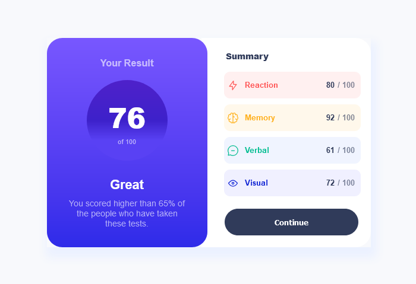

# Frontend Mentor - Results summary component solution

This is a solution to the [Results summary component challenge on Frontend Mentor](https://www.frontendmentor.io/challenges/results-summary-component-CE_K6s0maV).

## Table of contents

- [Overview](#overview)
  - [The challenge](#the-challenge)
  - [Screenshot](#screenshot)
  - [Links](#links)
- [My process](#my-process)
  - [Built with](#built-with)
- [Author](#author)

## Overview

### The challenge

Users should be able to:

- View the optimal layout for the interface depending on their device's screen size
- See hover and focus states for all interactive elements on the page
- Use the local JSON data to dynamically populate the content

### Screenshot

### Links

- This is the [solution URL](https://www.frontendmentor.io/solutions/results-summary-component-HTu6EtHwf0)
- This is the [live site URL](https://soufyane4.github.io/Results-Summary-Component/)

## My process

### Built with

- CSS custom properties
- Flexbox
- CSS Grid
- Mobile-first workflow
- Json

## Author

- Frontend Mentor - [@Soufyane4](https://www.frontendmentor.io/profile/Soufyane4)
- Twitter - [@O_Soufyane](https://x.com/O_Soufyane)
